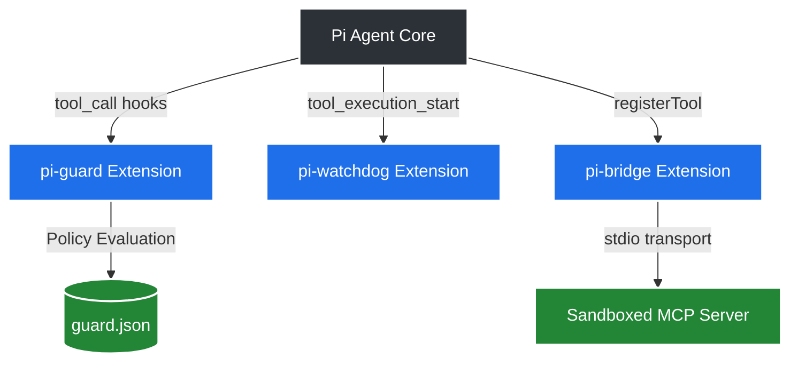

# Fluffy Harness: Pi Agent Improvement Suite

[](https://opensource.org/licenses/MIT)
[](https://www.typescriptlang.org/)
[](#)
[](https://github.com/Paramveersingh-S/fluffy-harness/pulls)

Welcome to the **Pi Agent Improvement Suite**! This repository provides enterprise-grade extensions, integrations, and core patches for the [earendil-works/pi](https://github.com/earendil-works/pi) coding agent. It drastically enhances Pi's security, operational reliability, and ecosystem connectivity.

---

## 📑 Table of Contents
1. [Core Components](#-core-components)
2. [Architecture Overview](#-architecture-overview)
3. [Technical Deep Dive](#-technical-deep-dive)
4. [Security Caveats](#-security-caveats)
5. [Installation & Setup](#-installation--setup)

---

## 🚀 Core Components

### 1. 🛡️ `pi-guard` (Granular Permission Policy)
A headless-compatible sandbox policy engine that operates via a native `beforeToolCall` hook. 
- **Declarative Policies**: Define JSON policies (`guard.json`) using robust glob matching for filesystem paths and regex matching for bash commands.
- **Fail-Closed Mechanics**: Automatically blocks destructive bash commands or sensitive file writes if the policy engine fails to load or parse configurations.
- **Audit Logging**: Features robust, regex-based secret redaction (API tokens, passwords) in its JSONL audit logs (`~/.pi/agent/guard-audit.jsonl`).
- **Location:** `packages/pi-guard/`

### 2. ⏱️ `pi-watchdog` (Timeout & Anti-Wedge)
Prevents the Pi Agent from suffering silent deadlocks and hanging indefinitely due to unresolved asynchronous streams (Issue #2381).
- **Track A (Upstream PR):** `upstream-pr/` contains a surgical core patch introducing `streamTimeoutMs` and `toolTimeoutMs` utilizing `Promise.race` handlers to gracefully fail-closed on timeout.
- **Track B (Userspace Extension):** `packages/pi-watchdog/` tracks the lifespan of active tool executions, emitting warnings and notifications if a tool hangs for longer than a predefined threshold.

### 3. 🌉 `pi-bridge` (MCP Integration)
Connects the Pi agent to Model Context Protocol (MCP) servers using `stdio` transport. 
- **Dynamic Translation**: Bridges JSON Schema natively into Pi's internal `TypeBox` structures.
- **Secure by Default**: Tools registered through this bridge are funneled through Pi's native hook system—meaning they are perfectly secured and audited by your `pi-guard` policies!
- **Location:** `packages/pi-bridge/`

---

## 📐 Architecture Overview

The system architecture utilizes the `ExtensionAPI` event bus to intercept tool executions and dynamically register MCP tools into the core lifecycle.



---

## 🔬 Technical Deep Dive

### Event Hook Routing (`pi-guard`)
`pi-guard` binds to the `tool_call` event emitted by the `pi-coding-agent`. Before the underlying tool's `execute()` method resolves, `pi-guard` evaluates the invocation against its merged policy (global `~/.pi/agent/guard.json` overlaid by local `.pi/guard.json`). Actions are resolved as:
- `allow`: Execution proceeds seamlessly.
- `confirm`: Pauses execution and utilizes `ctx.ui.confirm` to ask for manual approval. Degrades to `deny` in headless environments.
- `deny`: Rejects execution instantly.
- `log`: Allows execution but forces an audit write.

### MCP Lifecycle Integration (`pi-bridge`)
Instead of proxying tool calls blindly, `pi-bridge` utilizes `pi.registerTool()`. This natively embeds MCP capabilities directly into the agent's context. By doing this, any invocation of an MCP tool is correctly broadcast across the `ExtensionAPI` event bus. This guarantees that `pi-watchdog` tracks its timeout, and `pi-guard` scans its inputs.

---

## ⚠️ Security Caveats
`pi-guard` is a **best-effort**, in-process policy enforcer. It parses commands and enforces regex/glob policies but *does not* provide hardware virtualization or strict container boundaries. Do not rely on it to contain explicitly malicious AI actions. 

**Best Practice:** Use it as an additional layer of defense and logging alongside proper execution environments (like Docker containers or Gondolin micro-VMs).

---

## 💻 Installation & Setup

1. **Clone the repository:**
   ```bash
   git clone https://github.com/Paramveersingh-S/fluffy-harness.git
   cd fluffy-harness
   ```

2. **Install and compile individual packages:**
   ```bash
   # pi-guard
   cd packages/pi-guard && npm install && npm run build && cd ../..
   
   # pi-bridge
   cd packages/pi-bridge && npm install && npm run build && cd ../..
   
   # pi-watchdog
   cd packages/pi-watchdog && npm install && npm run build && cd ../..
   ```

3. **Register the extensions with Pi:**
   Add the following paths to your project's `package.json` under the `pi` namespace:
   ```json
   {
     "pi": {
       "extensions": [
         "./packages/pi-guard/dist/index.js",
         "./packages/pi-bridge/dist/index.js",
         "./packages/pi-watchdog/dist/index.js"
       ]
     }
   }
   ```
   *Note: Absolute paths can also be used if installing globally.*

---
*Built with ❤️ for the Pi Agent ecosystem.*
