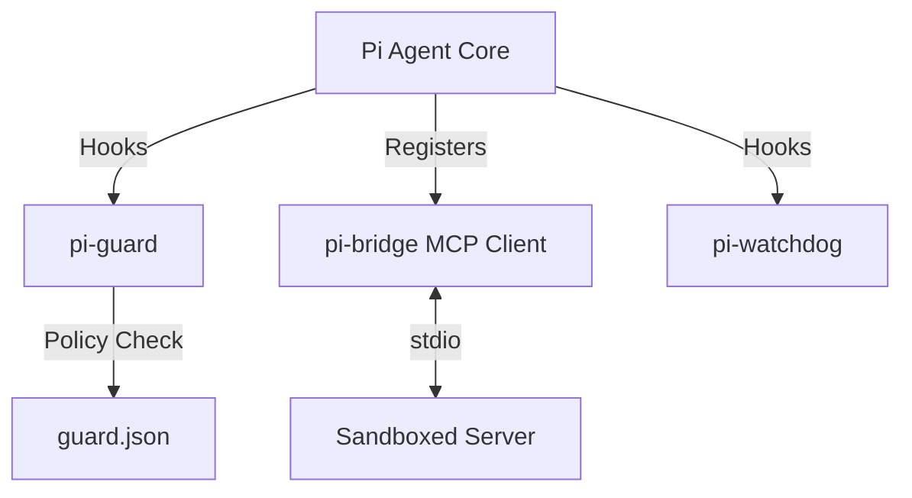

# Fluffy Harness: Pi Agent Improvement Suite

Welcome to the **Pi Agent Improvement Suite**! This repository provides enterprise-grade extensions and core patches for the [earendil-works/pi](https://github.com/earendil-works/pi) coding agent.

## Components

### 1. 🛡️ `pi-guard` (Granular Permission Policy)
A headless-compatible sandbox policy engine. Define declarative JSON policies using glob matching and regex to automatically block destructive bash commands or sensitive file writes. Features robust secret redaction in its JSONL audit logs.
- **Location:** `packages/pi-guard/`

### 2. ⏱️ `pi-watchdog` (Timeout & Anti-Wedge)
Prevents the Pi Agent from hanging indefinitely.
- **Track A:** `upstream-pr/` contains a surgical core patch adding `streamTimeoutMs` and `toolTimeoutMs` to gracefully fail closed.
- **Track B:** `packages/pi-watchdog/` is an extension that alerts users when tools run longer than 60 seconds.

### 3. 🌉 `pi-bridge` (MCP Integration)
Connects to Sandboxed Code Execution MCP servers dynamically. Crucially, tools registered through this bridge are funneled through Pi's native hook system—meaning they are perfectly secured by `pi-guard`!
- **Location:** `packages/pi-bridge/`

## Architecture


## Security Caveats
`pi-guard` is a best-effort, in-process policy enforcer. It parses commands and enforces regex/glob policies but does not provide hardware virtualization or strict container boundaries. Use it as an additional layer of defense alongside proper execution environments (like Docker or Gondolin micro-VMs).

## Installation

```bash
# Clone the repository
git clone https://github.com/Paramveersingh-S/fluffy-harness.git
cd fluffy-harness

# Install individual packages
cd packages/pi-guard && npm install && npm run build
```

Then register them in your Pi project:
```json
{
  "pi": {
    "extensions": [
      "/path/to/fluffy-harness/packages/pi-guard/dist/index.js",
      "/path/to/fluffy-harness/packages/pi-bridge/dist/index.js",
      "/path/to/fluffy-harness/packages/pi-watchdog/dist/index.js"
    ]
  }
}
```
